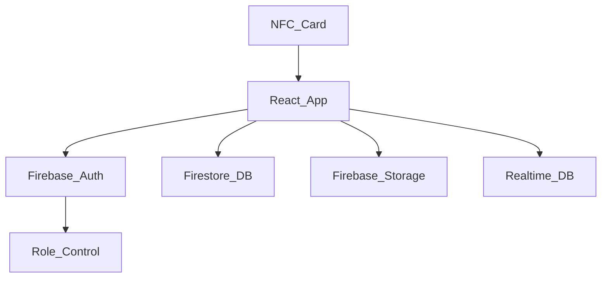

#  Healthcare Management System using NFC & Firebase

A modern healthcare web application that integrates **NFC cards** for patient identification and **Firebase** for secure backend services like authentication, storage, and database management.

##  Features

- 🔐 Role-based Authentication (Patient, Doctor, Nurse)
- 📇 NFC integration for patient identification
- 📁 Document upload (e.g. CT scans, blood reports) by staff
- 📄 Patient portal to view medical records
- 🔄 Real-time updates using Firebase Realtime Database
- ☁️ Secure file uploads via Firebase Storage

##  Tech Stack

- **Frontend**: React + TypeScript + TailwindCSS + Framer Motion
- **Backend**: Firebase (Auth, Firestore, Realtime DB, Storage)
- **Other**: NFC Reader API, Lucide Icons, React Router

##  Project Architecture



##  Folder Structure

```
src/
├── components/
│   └── NFC/
│       ├── NFCReader.tsx
│       └── NFCWriter.tsx
├── contexts/
│   └── AuthContext.tsx
├── pages/
│   ├── PatientDashboard.tsx
│   ├── DoctorDashboard.tsx
│   └── Register.tsx
├── services/
│   └── firebase.ts
└── App.tsx
```

##  Installation

```bash
git clone https://github.com/yourusername/healthcare-nfc-firebase.git
cd healthcare-nfc-firebase
npm install
```

##  Firebase Configuration

1. Go to [Firebase Console](https://console.firebase.google.com/)
2. Enable:
   - Firebase Authentication
   - Firestore Database
   - Realtime Database
   - Firebase Storage
3. Copy Firebase config and paste into `src/services/firebase.ts`

```ts
const firebaseConfig = {
  apiKey: "YOUR_API_KEY",
  authDomain: "YOUR_PROJECT_ID.firebaseapp.com",
  projectId: "YOUR_PROJECT_ID",
  storageBucket: "YOUR_PROJECT_ID.appspot.com",
  messagingSenderId: "YOUR_SENDER_ID",
  appId: "YOUR_APP_ID"
};
```

##  NFC Integration (Web NFC)

```ts
const nfc = new NDEFReader();
await nfc.scan();
nfc.onreading = (event) => {
  const decoder = new TextDecoder();
  const patientId = decoder.decode(event.message.records[0].data);
  // Fetch patient record from Firestore
};
```

##  Firebase Security Rules

### Firestore Rules

```js
rules_version = '2';
service cloud.firestore {
  match /databases/{database}/documents {
    match /patients/{userId} {
      allow read, write: if request.auth != null && request.auth.uid == userId;
    }
    match /documents/{docId} {
      allow write: if request.auth.token.role == 'doctor' || request.auth.token.role == 'nurse';
      allow read: if request.auth.uid == resource.data.owner;
    }
  }
}
```

### Realtime Database Rules

```json
{
  "rules": {
    ".read": "auth != null",
    ".write": "auth != null"
  }
}
